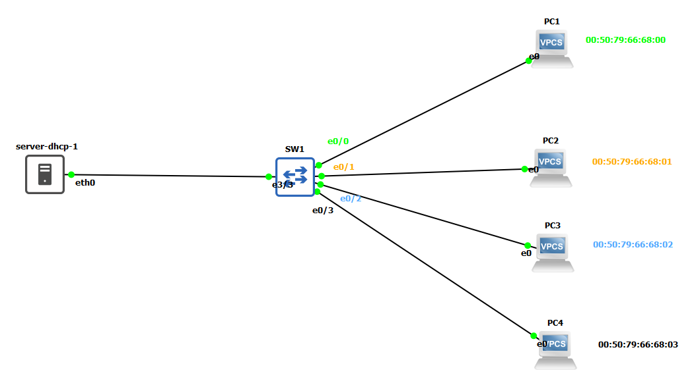

# Authentification par adresse MAC
* **Principe :** chaque carte réseau possède **une adresse MAC** unique. Le commutateur ou le serveur d’authentification compare l’adresse MAC de l’appareil à une liste blanche (**MAC Filtering**).
* **Avantage :** simple à mettre en œuvre.


### Infrastructure réseau


### Principe de base

Chaque carte réseau (interface) possède une adresse MAC unique, gravée en usine.
**Exemple :** 00:50:79:66:68:01

Cette adresse identifie la machine sur le réseau local (niveau 2 – couche liaison).

* L’authentification par adresse MAC consiste à :

    * autoriser l’accès réseau seulement aux adresses MAC connues (**liste blanche**).
    * et bloquer toutes les autres.

### Etapes de fonctionnement sur un switch
###### 1.Connexion du poste client
- Lorsqu’un poste (PC1) se connecte sur un port du switch, il envoie des trames Ethernet.
- Chaque trame contient son adresse MAC source
###### 2.Lecture de l’adresse MAC
Le commutateur lit l’adresse MAC source de la trame qui arrive sur le port.

###### 3.Vérification
Le switch compare cette adresse à sa table d’adresses MAC autorisées.

* Si l’adresse est autorisée (présente dans la liste blanche) :
→ le trafic est accepté et le port reste ouvert.

* Si l’adresse est non autorisée :
→ le switch applique la politique de sécurité configurée :

    * ``protect`` : ignore simplement les trames non autorisées

    * ``restrict`` : ignore les trames et génère une alerte

    * ``shutdown`` : désactive le port complètement


ainsi, même si le port redémarre, il ``se souvient`` de l’adresse autorisée.
###### 4.Surveillance
L’administrateur peut surveiller les ports sécurisés :
````bash
show port-security
show port-security interface fa0/1
````
### Limites

* Facile à contourner : un attaquant peut changer son adresse MAC (**spoofing**) pour imiter un appareil autorisé.
* Aucune vérification d’identité de l’utilisateur : seul le matériel est pris en compte.
* Maintenance lourde : il faut tenir à jour la liste des adresses MAC autorisées.

# Partie pratique
### Configurer le switch
.png)

* **Liste blanche**:
````
eth0/0   00:50:79:66:68:00
eh0/1   00:50:79:66:68:01
eth0/2   00:50:79:66:68:02
eth0/3   00:50:79:66:68:03
````
* **Exemple de configuration pour le port eth0/0**
````bash
SW1(config)#interface ethernet0/0
SW1(config-if)#switchport mode access
SW1(config-if)#switchport port-security ##Active la sécurité MAC --> Le switch surveille le port
SW1(config-if)#switchport port-security maximum 1 ##une seule machine autorisée
SW1(config-if)#switchport port-security mac-address 00:50:79:66:68:00   ## seule cette @MAC passe
SW1(config-if)#switchport port-security violation restrict   ##Action si violation --> Blocage + alerte console

SW1(config-if)switchport port-security violation shutdown ## le port se desactive en cas de violation
````
.png)

### Phase de testes
###### Cas violation
.png)

* **Notification sur le switch :**
.png)
.png)